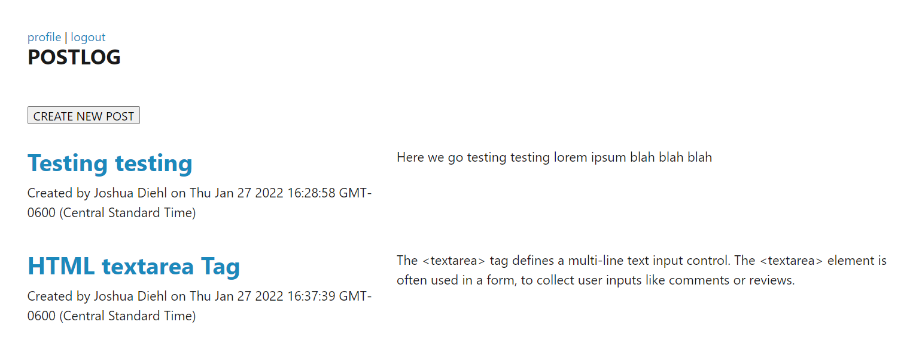

#   🧑‍💻 Blog-O-Tech 🧑‍💻

### A simple central hub for communing with techies 
   

> **||Blog-O-Tech||** 
  
   

### *DESCRIPTION* 
> Built with the tech-savvy and knowledge-hungry in mind, Blog-O-Tech is a discussion board for all things tech-related.
>  
>>>  
___  

## *Table of Contents*
### (*Internal navigation links*)
- [Usage](#usage)
- [Features](#features)
- [Screenshots](#screenshots)
- [Credits](#credits)
- [Live](#live)

> *Note: The click-through links contained within the discussion sections may send you to an external site.*  
___  
___
___
>  ### **USAGE**
>>>  *Entering the discussion*  
>>>>  - The user enters personal credentials to securely create an account.
>>>>  - The user who has already created an account  enters their email and password to login to the application.  
>>>>  - Once securely logged in, the user is presented with the homepage which includes posts made by any and all users previously.  
>>>>  - The user may click on the profile link to be taken to a page with information and posts unique to the user's account.
>>>>  - At the home page, the user clicks the "create new post" button to be presented with a form page for a new blog post.  The user enters a name and body for the post and clicks submit, and the user's post is populated onto the homepage along with the posts of all other users.
___  
___
___  
> - ### **FEATURES**
>>>  *(Under the Hood)*  
>>>  *Built using Model-View-Controller design architecture, this application makes use of the following technologies:*
>>>> - Uses bcrypt npm package to hash passwords and enable authenticated sessions to protect user credentials.
>>>> - Uses Express.js to engineer controllers to manage communication between front and back end.
>>>> - Uses Sequelize Object-Relational-Mapping package through Node.js to model database objects transported by Express.  
>>>> - Uses Handlebars.js through NPM to render views with dynamic data.
___  
___
___  
>  ### **SCREENSHOTS**
>>>  *Check it out*  
>>>>  
___  
>>>>  
___  
>>>>  

___  
___
___  
>  ### **CREDITS**
>>>  *Contributions |&&| Honorable Mentions*  
>>>>  SMU Coding Boot Camp, for valuable knowledge and support.  
>>>>  The developers at Express.js, Node.js, and Sequelize ... you are awesome!
___  
___
___  
> - ### **LIVE**
>>>  *The App in its natural state*  
>>>>  [Blog-O-Tech Deployed](https://glacial-sands-70721.herokuapp.com/)
___  
___
___  

## About the Creator

> ### *Joshua Newell Diehl*
>>>  
>>> is a budding developer currently based in Ft Worth, Texas.  He enjoys coding, long romantic hours dead asleep, walks with his dog Margot, and *creepily* referring to himself in third person.  
>>>>  
>>>> Here are a few of his favorite technologies at the moment:
>>>> - [Tailwind.css](https://tailwindcss.com/)
>>>> - [React.js](https://reactjs.org/)  
>>>> - [MongoDB](https://www.mongodb.com/)  
>>>> - [Express.js](https://expressjs.com/)

>>>>  
>>  
>>> And here is where you can reach him [||](https://developer.mozilla.org/en-US/docs/Web/JavaScript/Reference/Operators/Logical_OR 'Javascript OR Operator') review the work he's been doing:   
>>>
>>> [GitHub](https://github.com/JaynewDee 'Repositories authored by Joshua Newell Diehl')  
>>> [Email](mailto:jdiehl2236@gmail.com)  
>>> [Portfolio](https://jaynewdee.github.io/Personal-Portfolio-Bluev2/)
>>>
>>>> ~ *Let's build something awesome.*